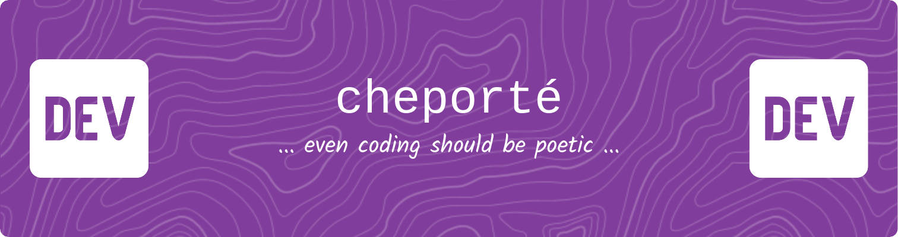

> *“Not all wanderers are lost—some are just debugging the stars.”*

---

## Table of Contents
1. [About Me](#-about-me)
2. [Technologies and Tools](#-technologies-and-tools)
3. [My Projects](#-my-projects)
4. [Leave a Whisper](#-leave-a-whisper)
5. [Read More](#-read-more)

---

## 🧑‍💻 About Me
- 🌱 Forever a seeker, I chase the endless horizons of technology. Nothing escapes my curious gaze! 👀
- 📖 A CS student by day, a dreamer by night—crafting code that whispers beauty and chaos into the void.
- ⚡ My peculiar fascinations:
  - 📚 Novels & poetry—where words are galaxies, and I’m lost among the stars. (Yes, I romanticize *everything*.)
  - ☕ Coffee—the elixir of life, brewed dark enough to mirror my late-night debugging sessions.
  - 🦉 Owls—wise observers of the night, peering into your soul... but only if they like you.
  - 🌍 Languages—each one a new spell to weave meaning into the world. My progress bar:
    - 🇺🇦 Ukrainian – native (my mother tongue, my roots 🌻)
    - 🇷🇺 Russian – a chapter I’d rather close.
    - 🇬🇧 English – C1 and climbing, fueled by books and memes.
    - 🇫🇷 French – B1, mais j’y mets tout mon cœur !
    - 🇯🇵 Japanese – just a vibe I can’t resist ✨

### 📈 My Stats

<!-- GitHub Readme Stats -->

<!-- Top Languages -->

> *Could be better, but I won't stop learning!*
---

## 🔧 Technologies and Tools
### 💬 Languages I Whisper To (Computers Mostly)
- 🔷 **TypeScript** – my spellbook for crafting web magic with React & its pals.
- ⚛️ **JavaScript** – the old friend I still call when TypeScript’s feeling shy.
- 🐍 **Python** – for when I want my code to feel elegant and serpentine.
- ☕ **Java** – where I brew object-oriented wonders (with a pinch of Kotlin spice).
- 💻 **C / C++** – digging deep into the machinery of thoughts.
- 🦀 **Rust** – the siren song I’m drawn to, but haven’t yet embraced (soon... 👀).

### 🧱 Frameworks & Libraries
- ⚛️ **React & React Native** – my go-to for painting the web and mobile dreams.
- 🌶️ **Flask** – for serving up backends with a sprinkle of spice.
- 🧊 **Qt** – a playground for crafting desktop wonders.
- ☕ **JavaFX** – where I'm learning to breathe life into Java GUIs.

### 🧰 Tools of the Trade
- 🧠 **Git** – because my memory is as unreliable as a non-commit.
- ⚡ **Vite** – as fast as my midnight ideas (but more structured).
- 🎨 **Sass** – because plain CSS is like painting with one color.
- 🔥 **Firebase** – for dreams that need real-time sparks.
- 📄 **Markdown** – my paper and pen in the digital realm.
- 🎮 **Godot Engine** – the canvas for my indie game aspirations.

---

> Yeah, I know—I’m crazy for trying to learn *everything*. But what’s life without a bit of chaos? Can’t wait to expand this list with even more tools and tech. 🌌

---

## 🌟 My Projects

| Name | Description | Status |
| ---- | ----------- | ------ |
| **[Mephisto](https://github.com/saisenko/mephisto)** | An "IDE" for RISC-V programming—a resurrection of an idea, now powered by Qt. Think of it as: if low-level had a spa day. | WIP |
| **[mnogomov](https://github.com/cheporte/mnogomov)** | A language-learning app built with React and TypeScript. Because learning should be fun! | WIP |
| **[chez-che-che](https://cheporte.github.io/chez-che-che)** | A restaurant site filled with chef musings and a cozy carousel. | WIP |

See my other projects here 👉 [Explore All Projects](docs/projects.md)

---

## 👋 Leave a Whisper
- 💌 Reach me at: [cheporte.dev@gmail.com](mailto:cheporte.dev@gmail.com)
- 🌐 Explore my misty gardens: [Portfolio](https://github.com/cheporte/jardin-de-cheporte) (WIP, nevermind)
- 🐦 Find me on Twitter: [@le_che_che](https://twitter.com/le_che_che)

---

## 📂 Read More
- [📘 Projects Overview](docs/projects.md)
- [🎨 Moodboard](docs/moodboard.md)
- [💭 My Learning Journey](docs/learning-journey.md)
