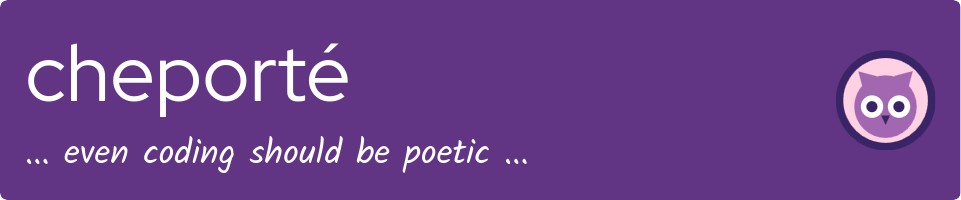

<picture>
<source media="(prefers-color-scheme: dark)" srcset="./img/github-header-image-dark.png">
<source media="(prefers-color-scheme: light)" srcset="./img/github-header-image-light.png">

</picture>

> *“Not all wanderers are lost—some are just debugging the stars.”*

<!-- I'm not good enough for this T^T -->
<!--  -->

🌱─── About Me ───🌱

🌇 programmer at dawn, poet at dusk 🌆 | coffee addict ☕ | owl manic🦉 | debugging myself 🌐 | overthinking.exe ☁️ | emotionally open-source 💞 | forever in beta 🌙 | ./chronic_loner.sh 🌒

🛠️─── Tech Arsenal ───🛠️

### ⚡ The MERN Stack - From Haters to Lovers

  

*Built with dreams, rebellion, and 3AM coffee.*

Want to see what other forbidden spells I know? ➡️ [Click to open the Arcane Codex](docs/skills.md)

─── My Treausure ───

> 🔎 *Want to see more? ➡️ [Explore All Projects](docs/projects.md)*

😵‍💫─── Commit Swings ───😵‍💫

---

> 🌟 *“The horizon isn't the limit—it's just the starting line.”* 🌟

---
**Made with dreams, bugs, and lots of coffee by your petit [che-che](https://github.com/cheporte) ☕✨**
---
